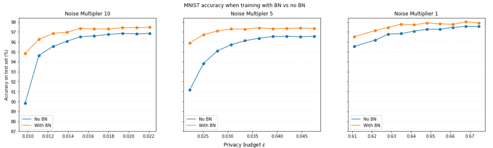
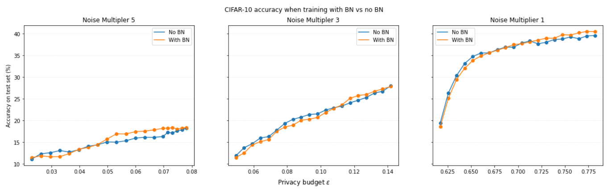

# CS523_Project
Deep learning Team Project 2022 - The tradeoff between privacy and robustness when training with Batch Normalization

Our task is to train a model to be both robust and deferentially private (DP) with and without using Batch Normalization. We want to test whether batch normalization can improve the trade-offs between robustness and privacy observed in the literature. We train models for two image classification tasks: MNIST and CIFAR-10. 

## Usage

To run experiments on MNIST use: 
```
python vision.py --dataset mnist 
```
To run experiments on CIFAR-10 use: 
```
python vision.py --dataset cifar10
```
Check ``vision.py`` for all other parameters that can be specified, such as number of epochs, privacy parameters, robustness parameters, etc. 
Check ``images`` file for all results of training on the MNIST and CIFAR-10 datasets with Projected Gradient Descent and ``src`` for all the files used for the project such as  


We have combined the DP with Batch Norm training algorithm of [[1]](#1) together with robust Projected Gradient Descent (PGD) training. We have updated the [code](https://github.com/uds-lsv/SIDP) of [[1]](#1) to support robust training. For each batch, we create a new adversarial batch formed by doing gradient ascent on the current batch. The goal of gradient ascent is to maximize the loss the model on the perturbed batch. The [following code](https://gist.github.com/oscarknagg/45b187c236c6262b1c4bbe2d0920ded6##file-projected_gradient_descent-py) for PGD is obtained and modified to work for our traiing procedure. 

To preform BatchNorm, the approach of [[1]](#1) is to use a small public dataset and augment each batch of the data with the public dataset. The public dataset is disjoint from the training data. The Public dataset does not contribute to training, but is only used to calculate the mean and standard deviation for each normalization layer. For MNIST, the apporach of [[1]](#1) is to use 128 image form to KMIST datset as the publicly available dataset.

## Testing
We compare DP + robust training on the MNIST and CIFAR-10 datasets (with and without BatchNorm) for various amounts of adversarial noise and privacy budgets. The comparison will be in terms of the accuracy acheived by the model on the test dataset.

## Results
The following experiments were run with the LeNet-5model for the MNIST classification task for 10 epochs and ResNEt-18 model the CIFAR-10 classification for 20 epochs: 


Figure 1 depicts the average accuracy of the LeNet-5 model for different values of privacy budget espilon. For each of the condition the model was averaged over three runs. The dots in the grapgs represent an epoch of training. The experiment was tested over three noise multipliers (10, 5 and 1). It was found that with BatchNorm, the model consistenly improved the preformance of the model for all noise multiplers. . The differences between Batchnorm and no Batchnorm is as high as 5 percentage points when the noise multipler is 10 and epsilon is 0.01 and as low as 1 percentage point with low noise multipler and high privacy budget. 


Figure 2 depicts the average accuracy of the ResNet-18 model for different values of privacy budget epsilon. 
As expected, the accuracy achieve by the model decreases with the increase in the noise multipler
More epochs would have been needed for the models to achieve reasonable accuracy, but robust and DP training is very slow and can take up to an hour to run a epoch. For the first 20 epoch of training, there isnt any significat difference in the accuracy between both methods.  A distinction between the two methods could potentiallt show up in later epochs for training. 

The parameters for both models are as following: 
- Lenet-5 : Learning rate = 0.01 except for NM  = 1 where learning rate = 0.1; clipping value = 3.1; batch size = 32 [[1]](#1); adversarial steps = 40; 
- ResNet-18: Learning rate = 0.01, where learning rate = 0.1; clipping value = 3.1; batch size = 32 [[1]](#1); adversarial steps = 20[[2]](2); 
- For the robust training: alpha = 0.01 and projection norm = 0.03 [[2]](#2);

## References
<a id="1">[1]</a> 
Ali Davody, David Ifeoluwa Adelani, Thomas Klein-
bauer, and Dietrich Klakow. On the effect of normalization layers on differentially private training of deep
neural networks. CoRR, abs/2006.10919, 2020.
<a id="2">[2]</a> 
Badih Ghazi, Ravi Kumar, Pasin Manurangsi, andThao Nguyen. Robust and private learning of halfspaces. In Arindam Banerjee and Kenji Fukumizu, editors, The International Conference on Artificial Intelligence and Statistics (AISTATS), volume 130, pages 1603–1611, 2021
